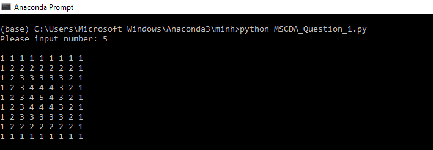
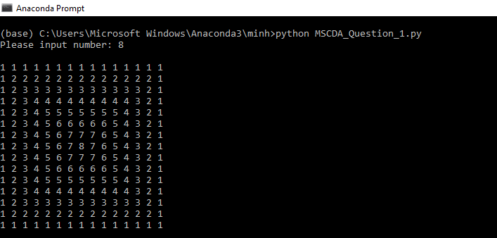
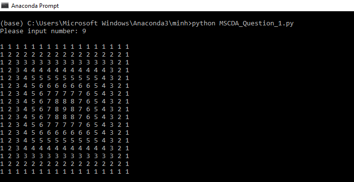
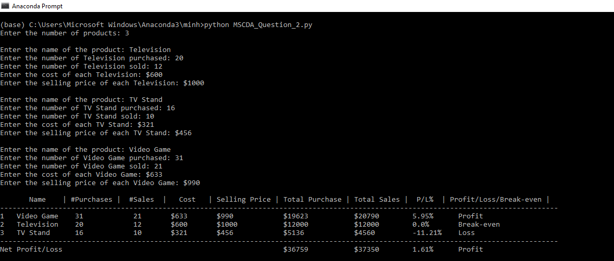
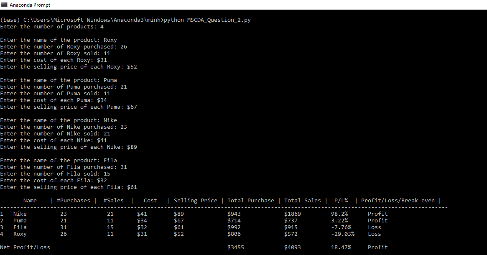
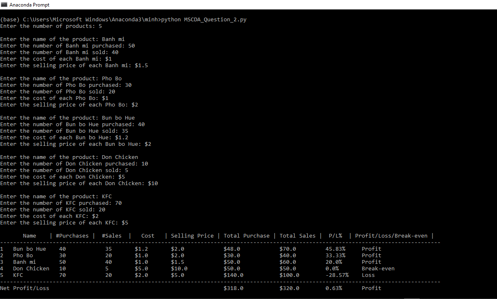

Question 1:
Run command: python MSCDA_Question_1.py
Case 1: n = 5
 
Case 2: n = 8 
 
Case 3: n = 9
 
 
 
Question 2:
Run command: python MSCDA_Question_2.py
Case 1: n = 3
 
Case 2: n = 4
 
Case 3: n = 5
 

